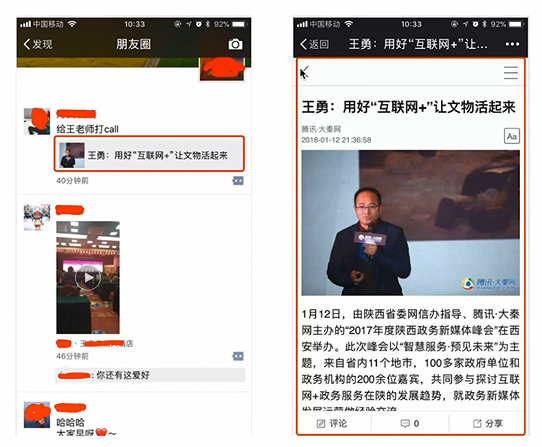

# hybrid

### hybrid是什么，为何会使用hybrid
hybrid即"混合"，即前端和客户端的混合开发，某些环节也可能涉及server端

hybird存在的核心意义在于快速迭代，无需审核

具体实现：
 - 前端做好静态网页，将文件交给客户端
 - 客户端拿到前端静态网页，以文件形式存储在app中
 - 客户端在一个webview中使用file协议加载静态页面

### 各技术适用场景
 - 使用NativeApp
   - 体验要求极致，变化不频繁
 - 使用hybrid
   - 体验要求高，变化频繁
 - 使用h5
   -体验要求低，不常用

### hybrid存在价值
 - 可快速迭代更新
 - 体验流畅
 - 双端公用一套代码

### webview
 - 是app中的一个组件。
 - 用于加载h5页面，即小型浏览器内核
 - 只是单纯的展示一个网页界面 

### file协议
加载本地的资源

### app发布后，静态文件如何实时更新？
 - 将静态文件(html,css,js等)压缩成包，上传到服务端
 - 客户端每次启动，都去服务端检查静态文件发布日期
 - 如果服务端发布日期晚与客户端使用资源的发布日期，就去下载最新的压缩包
 - 下载完成后解压，将现有文件覆盖